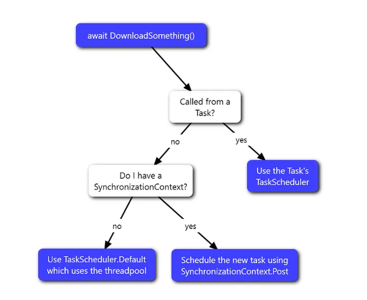

# Async internals

## [ExecutionContext](https://devblogs.microsoft.com/pfxteam/executioncontext-vs-synchronizationcontext/)

The execution context is a wrapper around different contexts such as: SecurityContext, HostExecutionContext, CallContext, etc..

ExecutionContext is really just a state bag that can be used to capture all of this state from one thread and then restore it onto another thread while the logical flow of control continues.  ExecutionContext is captured with the static Capture method:

```csharp
// ambient state captured into ec
ExecutionContext ec = ExecutionContext.Capture();
```

and it’s restored during the invocation of a delegate via the static run method:

```csharp
ExecutionContext.Run(ec, delegate
{
    … // code here will see ec’s state as ambient
}, null);
```

## SynchronizationContext

SynchronizationContext is just an abstraction, one that represents a particular environment you want to do some work in.  As an example of such an environment, Windows Forms apps have a UI thread (while it’s possible for there to be multiple, for the purposes of this discussion it doesn’t matter), which is where any work that needs to use UI controls needs to happen.  For cases where you’re running code on a ThreadPool thread and you need to marshal work back to the UI so that this work can muck with UI controls, Windows Forms provides the Control.BeginInvoke method.

>**Synchronization Context is responsible for the continuation of a task, where the delegate will be POST-ed.**

If I was writing my component specifically to target Windows Forms, I might implement my go-to-the-ThreadPool-and-then-back-to-the-UI-thread logic something like the following:

```csharp
public static void DoWork(Control c)
{
    ThreadPool.QueueUserWorkItem(delegate
    {
        … // do work on ThreadPool
        c.BeginInvoke(delegate
        {
            … // do work on UI
        });
    });
}
```

If I was instead writing my component to use SynchronizationContext, I might instead write it as:

```csharp
public static void DoWork()
{
    var sc = SynchronizationContext.Current;
    ThreadPool.QueueUserWorkItem(delegate
    {
        … // do work on ThreadPool
        sc.Post(delegate
        {
            … // do work on the original context
        }, null);
   });
}
```

## Flowing ExecutionContext vs Using SynchronizationContext

Now, we have a very important observation to make: flowing ExecutionContext is semantically very different than capturing and posting to a SynchronizationContext.

When you flow ExecutionContext, you’re capturing the state from one thread and then restoring that state such that it’s ambient during the supplied delegate’s execution.  That’s not what happens when you capture and use a SynchronizationContext.  The capturing part is the same, in that you’re grabbing data from the current thread, but you then use that state differently.  Rather than making that state current during the invocation of the delegate, with SynchronizationContext.Post you’re simply using that captured state to invoke the delegate.  Where and when and how that delegate runs is completely up to the implementation of the Post method.

## How does this apply to async/await?

The framework support behind the async and await keywords automatically interacts with both ExecutionContext and SynchronizationContext.

Whenever code awaits an awaitable whose awaiter says it’s not yet complete (i.e. the awaiter’s IsCompleted returns false), the method needs to suspend, and it’ll resume via a continuation off of the awaiter.  This is one of those asynchronous points I referred to earlier, and thus, ExecutionContext needs to flow from the code issuing the await through to the continuation delegate’s execution.  That’s handled automatically by the Framework.  When the async method is about to suspend, the infrastructure captures an ExecutionContext.  The delegate that gets passed to the awaiter has a reference to this ExecutionContext instance and will use it when resuming the method.  This is what enables the important “ambient” information represented by ExecutionContext to flow across awaits.

When you await a task, by default the awaiter will capture the current SynchronizationContext, and if there was one, when the task completes it’ll Post the supplied continuation delegate back to that context, rather than running the delegate on whatever thread the task completed or rather than scheduling it to run on the ThreadPool.

The **ConfigureAwait** method returns an awaitable that enables this default marshaling behavior to be suppressed.

Why is this problematic?  Flowing SynchronizationContext as part of ExecutionContext changes the meaning of SynchronizationContext.Current.  SynchronizationContext.Current is supposed to be something you can access to get back to the environment that you’re currently in at the time you access Current, so if SynchronizationContext flows to be current on another thread, you can’t trust what SynchronizationContext.Current means.  In such a case, it could either be the way to get back to the current environment, or it could be the way to get back to some environment that occurred at some point previously in the flow.

 I previously mentioned that the “builders” for async methods were the types responsible for flowing ExecutionContext in async methods, and these builders do live in mscorlib, and they do use the internal overloads… as such, SynchronizationContext is not flowed as part of ExecutionContext across awaits (this, again, is separate from how task awaiters support capturing the SynchronizationContext and Post’ing back to it).

> I believe the following decision tree shows how it is working, if the await is called from the Task then simply schedule the continuation work on the ThreadPool otherwise check for the SynchronizationContext presents (probably these are the internal calls mentioned above).

