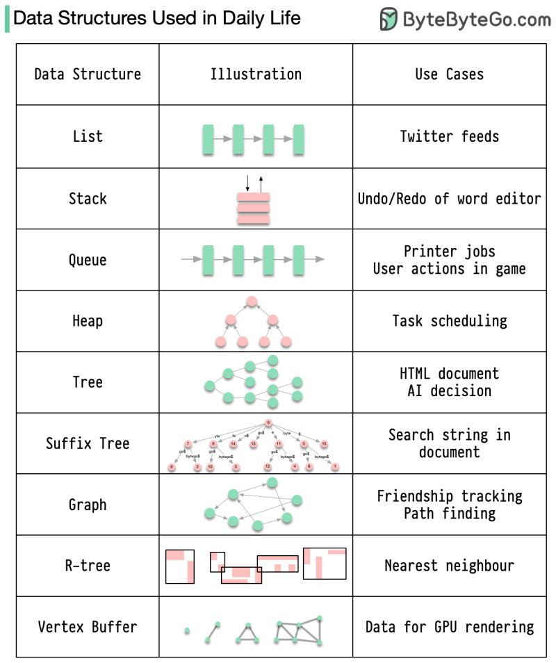
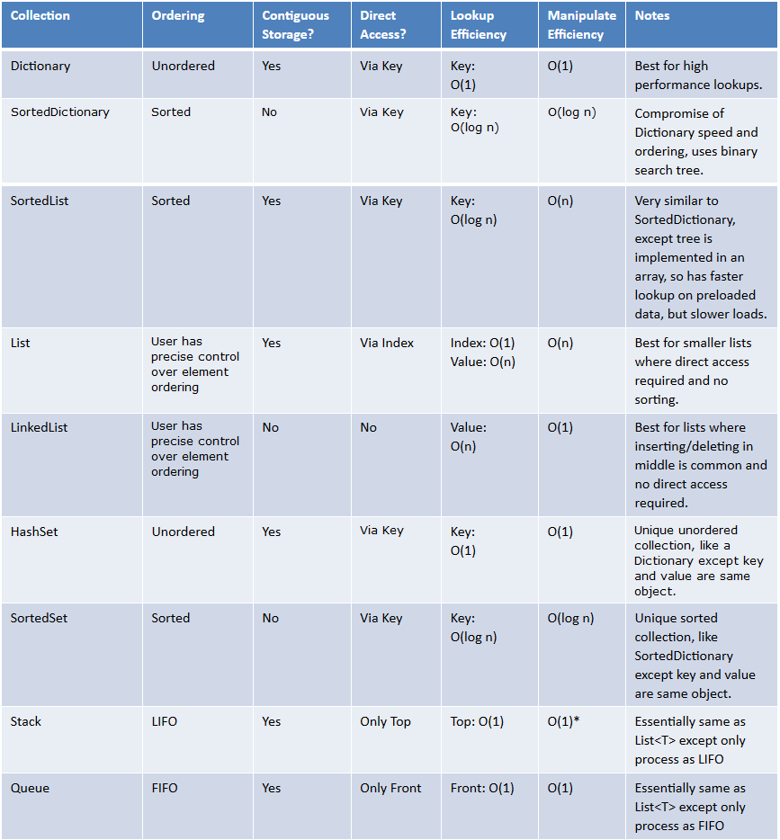
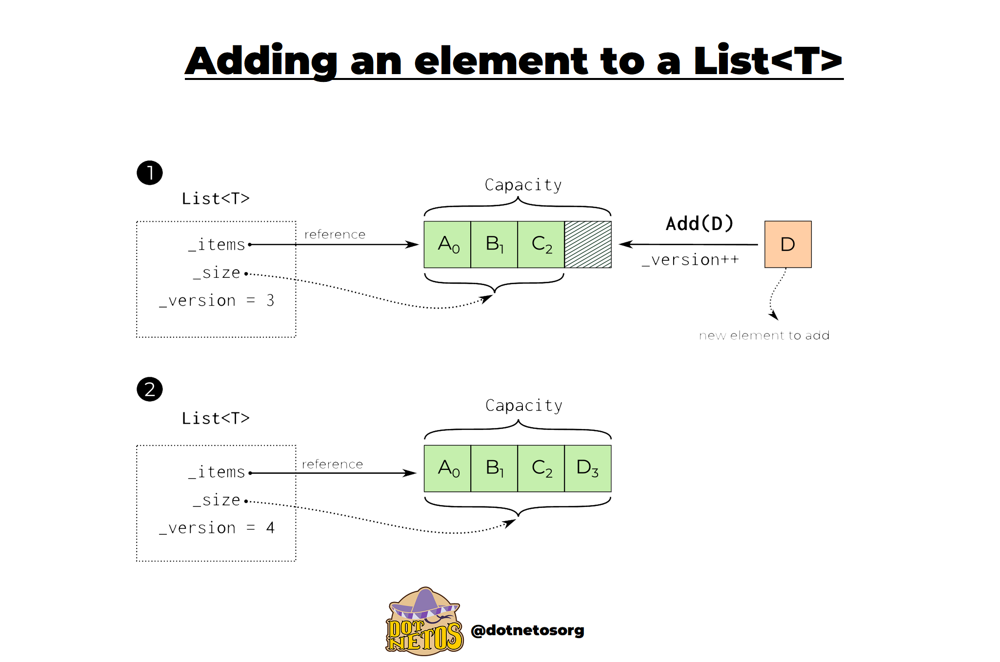

# Data structures

## Use cases

Dotnet related collections:

## List 

The C# List provides functionality to create a list of objects, add items to a list, and find, sort, and update items in the List.

- List is backed by an array[]
- If no more room is present in a list a new list is allocated and elements are copied into the new array.
- Add can be O(1) if there is Capacity in the collection otherwise O(n) as a new array is initialized and every element is copied + the new element is added.
- Lookup based on index is O(1) eg.: `some_list_variable[1]`
- Allows duplicates
- Used when we need a storage where we can have duplicates

## Dictionary

In C#, Dictionary is a generic collection which is generally used to store key/value pairs.

- In Dictionary, the key cannot be null, but value can be.
- In Dictionary, key must be unique. Duplicate keys are not allowed if you try to use duplicate key then compiler will throw an exception.
- In Dictionary, you can only store same types of elements.
- The capacity of a Dictionary is the number of elements that Dictionary can hold

