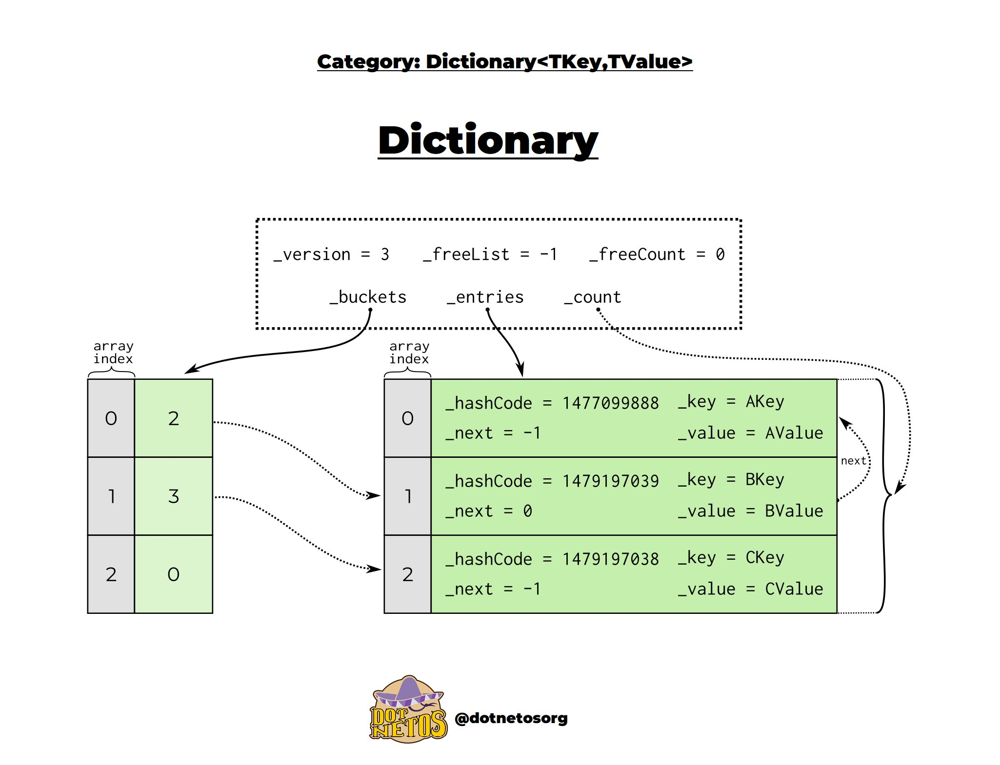
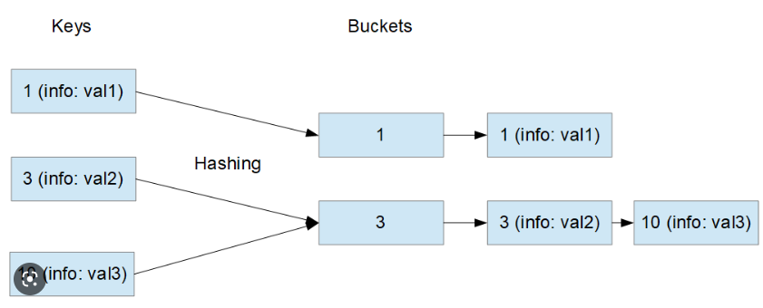
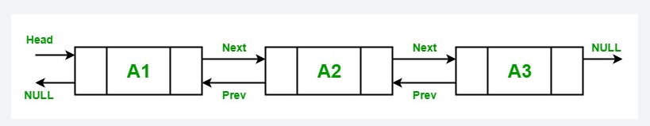

# Data structures

## Use cases

Dotnet related collections:

## List<T>

The C# List provides functionality to create a list of objects, add items to a list, and find, sort, and update items in the List.

- List is backed by an array[]
- If no more room is present in a list a new list is allocated and elements are copied into the new array.
- Add can be O(1) if there is Capacity in the collection otherwise O(n) as a new array is initialized and every element is copied + the new element is added.
- Lookup based on index is O(1) eg.: `some_list_variable[1]`
- Allows duplicates
- Used when we need a storage where we can have duplicates

## Dictionary<K, T>

In C#, Dictionary is a generic collection which is generally used to store key/value pairs.

- The key's `GetHashCode` is called to calculate the hash.
- In Dictionary, the key cannot be null, but value can be.
- In Dictionary, key must be unique. Duplicate keys are not allowed if you try to use duplicate key then compiler will throw an exception.
- In Dictionary, you can only store same types of elements.
- The capacity of a Dictionary is the number of elements that Dictionary can hold

## HashSet<T>

- Unordered
- Can not have `null`
- Can not have duplicates
- `GetHashCode` is used to bucket the element
- `Equals` is used to check if there is a duplicate in the bucket

## LinkedList<T>

- Fast insertion and deletion time as only the pointers need to be modified (O(1)).
- Accepts `null` as value
- Is only at it's most efficient if you are accessing sequential data (either forwards or backwards) - random access is relatively expensive since it must walk the chain each time (hence why it doesn't have an indexer).

## Concurrent (a.k.a Thread Safe)

- ConcurrentBag<T> - Unordered, can have duplicates
- ConcurrentDictionary<K, T> - ordered, can not have duplicates
- ConcurrentQueue<T> - FIFO
- ConcurrentStack - LIFO
- BlockingQueue<T>