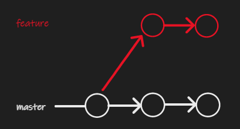
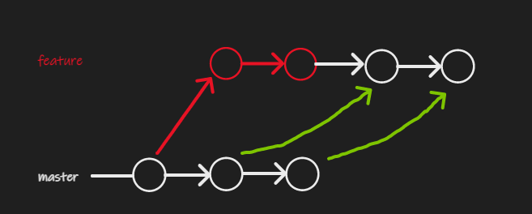
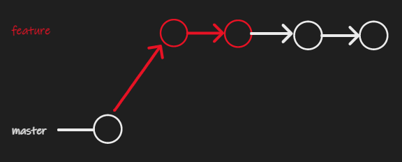
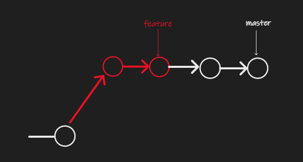

# Git useful stuff

## [Merge](https://git-scm.com/docs/git-merge)

[StackOverflow](https://stackoverflow.com/questions/9069061/what-effect-does-the-no-ff-flag-have-for-git-merge)

[Atlassian Blog](https://blog.developer.atlassian.com/pull-request-merge-strategies-the-great-debate/)

### Fast Forward Merge (Default)

`git merge <branch>`

With --ff, when possible resolve the merge as a fast-forward (**only update the branch pointer to match the merged branch; do not create a merge commit**). When not possible (when the merged-in history is not a descendant of the current history), create a merge commit.

Note that fast-forward updates do not create a merge commit and therefore there is no way to stop those merges with --no-commit.

**If fast forward merge is not possible then simple merge with merge commit will be created unless the `--ff-only` option is specified and in that case the merge will be stopped.**

### Merge without Fast Forward

`git merge <branch> --no-ff`

With --no-ff, create a merge commit in all cases, even when the merge could instead be resolved as a fast-forward.

### Squash Merge

`git merge --squash <branch>`  

Takes all commits from the `branch` branch and groups it for a 1 commit with your current branch. 

`git commit`

Creates a single commit from the merged changes.

## Rebase

`git rebase [<branch>]`

One of the uses of rebase is precisely to replay commits–one by one–on top of a specific branch. Note that this operation rewrites all the ids (sha-1) of those commits (new commits).  
This happens because when git computes the unique id of a commit it takes into account the parent commit. If the parent commit changes, the sha-1 of the replayed commit changes too.

**When executing the `git rebase <branch>` the current branch is going to be rebased on top of the specified branch.**

### Rebase steps

The initial state:

We have two branches, master and feature. The current branch is master.

`git rebase feature` command is executed meaning we wan to rebase the master on top of feature. The following actions will happen:

- The two commits from the master branch are cloned to the feature branch, as the commits take the sha-1 into account new commits are required as the parent pointer is modified for each commit.

- The two old commits will be cleared / detached (similar to `git reset --hard`).

- The branch pointers will look like this:

